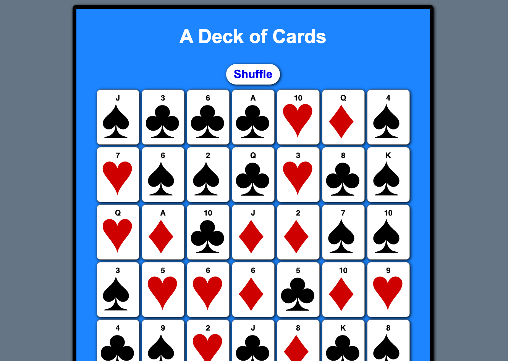

# Card Deck

GitHub Repo: [https://github.com/Robert-Schwartz/Card-Deck]  

View Live Website at: [https://robert-schwartz.github.io/Card-Deck/](https://robert-schwartz.github.io/Card-Deck/)  

## Description

A Simple card deck shuffler to display a set of 52 card images that can be shuffled

## Technologies

This project was built using HTML, CSS, Javascript

## Installation

- Clone the repo:

  use: `git clone https://github.com/Robert-Schwartz/Card-Deck` in the command line

## Contributions

Developed by:

Robert Schwartz - Github Profile: (https://github.com/Robert-Schwartz)  
